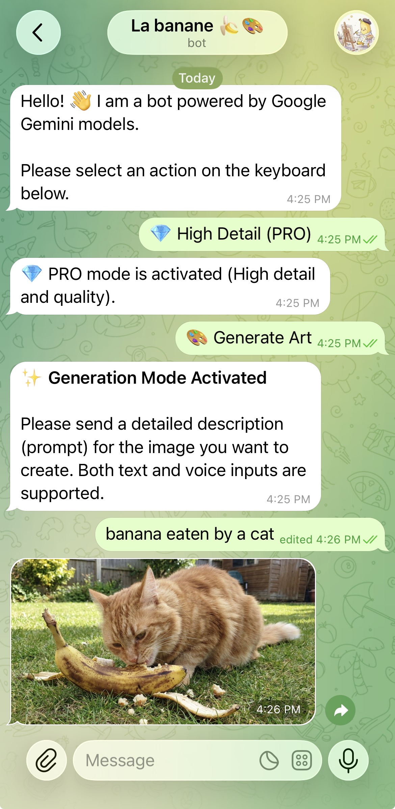
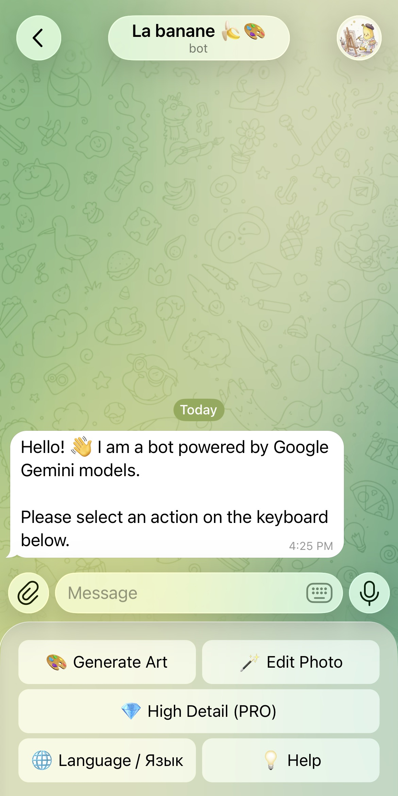

# 🍌 Banana Bot

Telegram bot for Google Gemini image workflows. The current version is intentionally small and focused: it helps users generate images from text or voice prompts, and edit uploaded photos directly inside Telegram.



## What It Does

- `🎨 Generate Art` creates an image from a text or voice prompt.
- `🪄 Edit Photo` edits a user-provided photo using a text or voice instruction.
- `💎 PRO / ⚡️ FLASH` switches between higher-detail and faster image modes.
- `🌐 Language / Язык` switches the interface between English and Russian.
- `💡 Help` shows a short usage guide inside Telegram.

## Interface Preview

The bot is designed around a very simple Telegram-first interface so users do not need to learn a separate AI app.



## Current Scope

This repository currently implements a focused media bot, not a full general-purpose chat assistant.

- Supported inputs: text, voice messages, and photos.
- Supported outputs: generated or edited images, plus transcribed voice text shown back to the user.
- Conversation memory is minimal and state-based: the bot uses FSM to keep track of the current step in the image flow.
- If `ALLOWED_USERS` is set, the bot works as a private whitelist-only bot. If it is empty, the bot becomes publicly reachable.

## Models And Modes

| Mode | Image generation / edit | Voice transcription |
| --- | --- | --- |
| `PRO` | `gemini-3-pro-image-preview` | `gemini-3-flash-preview` |
| `FLASH` | `gemini-3.1-flash-image-preview` | `gemini-3-flash-preview` |

## Tech Stack

- [Aiogram 3.x](https://docs.aiogram.dev/) for Telegram bot routing and FSM flows
- [Google GenAI SDK](https://github.com/googleapis/python-genai) for Gemini API access
- `aiohttp` for webhook serving
- `redis` as optional FSM storage
- `texts.py` for bilingual UI copy
- `config.py` for centralized runtime and model configuration

## Project Layout

```text
.
├── bot.py           # Telegram handlers and Gemini workflow logic
├── config.py        # Environment loading and model configuration
├── texts.py         # Localized user-facing strings
├── assets/          # README screenshots
└── requirements.txt
```

## Why This Structure

The codebase is still compact, but it now has a small separation between:

- runtime configuration in `config.py`
- bot flow logic in `bot.py`
- user-facing copy in `texts.py`

That is not a full modular architecture yet, but it gives a cleaner starting point for a future refactor into provider adapters, generic chat capabilities, and pluggable model backends.

## Setup

```bash
git clone <your_repo_url>
cd banana-bot
python3 -m venv venv
source venv/bin/activate
pip install -r requirements.txt
```

Create a `.env` file next to `bot.py`:

```env
TELEGRAM_BOT_TOKEN=your_token_from_@BotFather
GOOGLE_API_KEY=your_key_from_Google_AI_Studio
ALLOWED_USERS=123456789,987654321

# Optional: webhook mode
WEBHOOK_URL=https://your-domain.com
PORT=8080

# Optional: persistent FSM storage
REDIS_URL=redis://localhost:6379/0
```

Run locally:

```bash
python bot.py
```

If `WEBHOOK_URL` is not set, the bot starts in long-polling mode. If it is set, the bot starts an `aiohttp` webhook server on the configured port.

## Notes

- This version does not yet provide generic free-form LLM chat.
- This version does not yet include public-user protections like quotas or rate limits.
- Do not commit `.env` with real secrets.
