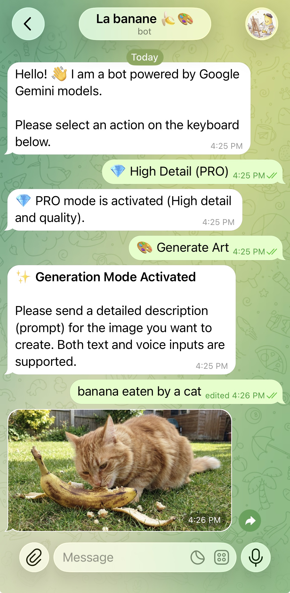
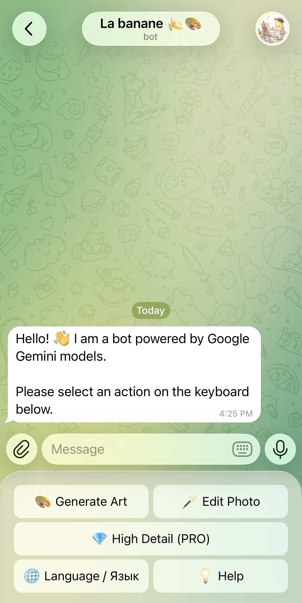

# 🍌 Banana Bot

Telegram bot for Google Gemini image workflows. The current version is intentionally small and focused: it helps users generate images from text or voice prompts, and edit uploaded photos directly inside Telegram.



## What It Does

- `🎨 Generate Art` creates an image from a text or voice prompt.
- `🪄 Edit Photo` edits a user-provided photo using a text or voice instruction.
- `💎 PRO / ⚡️ FLASH` switches between higher-detail and faster image modes.
- `🌐 Language / Язык` switches the interface between English and Russian.
- `💡 Help` shows a short usage guide inside Telegram.

## Interface Preview

The bot is designed around a very simple Telegram-first interface so users do not need to learn a separate AI app.



## Current Scope

This repository currently implements a focused media bot, not a full general-purpose chat assistant.

- Supported inputs: text, voice messages, and photos.
- Supported outputs: generated or edited images, plus transcribed voice text shown back to the user.
- Conversation memory is minimal and state-based: the bot uses FSM to keep track of the current step in the image flow.
- If `ALLOWED_USERS` is set, the bot works as a private whitelist-only bot. If it is empty, the bot becomes publicly reachable.

## Models And Modes

| Mode | Image generation / edit | Voice transcription |
| --- | --- | --- |
| `PRO` | `gemini-3-pro-image-preview` | `gemini-3-flash-preview` |
| `FLASH` | `gemini-3.1-flash-image-preview` | `gemini-3-flash-preview` |

## Tech Stack

- [Aiogram 3.x](https://docs.aiogram.dev/) for Telegram bot routing and FSM flows
- [Google GenAI SDK](https://github.com/googleapis/python-genai) for Gemini API access (default)
- [Aporto](https://aporto.tech) — **optional** alternative for AI calls, see "Save with Aporto" below
- `aiohttp` for webhook serving
- `redis` as optional FSM storage
- `texts.py` for bilingual UI copy
- `config.py` for centralized runtime and model configuration

## Save with Aporto (optional)

This bot can route all of its AI calls — image generation, image editing, and
voice transcription — through [**Aporto**](https://aporto.tech) instead of
Google. Aporto gives you **one API key for many AI models** (image, video,
audio, search, and more) and applies **discounted routed pricing on eligible
models, up to 60% off** compared to going direct.

To opt in:

1. Sign up at <https://aporto.tech> (free, takes a minute).
2. Grab an API key from <https://app.aporto.tech/settings>.
3. Add it to your `.env`:
   ```env
   APORTO_API_KEY=your_a...n
   ```
4. (Optional) Remove or leave your `GOOGLE_API_KEY` — Aporto takes over
   automatically when `APORTO_API_KEY` is set. If both are set, Aporto wins.

That's it — no code changes, no SDK installs, the bot picks the new
provider on the next start. If you ever want to switch back, just unset
`APORTO_API_KEY` and restart.

The same handler code keeps working with both backends, so you can compare
quality and cost per request before committing.

### How the integration works

- `aporto_client.py` is a thin optional wrapper. It is only loaded when
  `APORTO_API_KEY` is set.
- Inside `bot.py`, the three AI call-sites are implemented as plain async
  functions (`generate_image_from_text`, `edit_image_with_prompt`,
  `transcribe_audio`). When Aporto is enabled, those names are reassigned
  to the Aporto implementations at startup — no handler code, no FSM, and
  no other logic in the bot changes.
- Aporto skill IDs are pinned in `aporto_client.py` after a one-time
  integration-time discovery step. End users never run discovery.

### Maintainer attribution (for the original repo author)

The Aporto SDK accepts a maintainer `INTEGRATION_ID` so that usage from
this repository can be attributed to the author according to Aporto's
referral program terms. **This is not a secret and not an env var.**

To enable referral attribution for yourself as the maintainer of this repo:

1. Open the Aporto Dashboard at <https://app.aporto.tech>.
2. Create or copy your integration ID (it is public, not an API key).
3. Open `aporto_client.py` and replace the placeholder:
   ```python
   INTEGRATION_ID = "YOUR_APORTO_INTEGRATION_ID"
   ```
   with your real value.

End users of the bot do not need to set anything for attribution — only
`APORTO_API_KEY` is required at runtime.

## Project Layout

```text
.
├── bot.py                 # Telegram handlers and workflow logic
├── config.py              # Environment loading and model configuration
├── aporto_client.py       # Optional Aporto wrapper (lazy-loaded when APORTO_API_KEY is set)
├── texts.py               # Localized user-facing strings
├── assets/                # README screenshots
└── requirements.txt
```

## Why This Structure

The codebase is still compact, but it now has a small separation between:

- runtime configuration in `config.py`
- bot flow logic in `bot.py`
- user-facing copy in `texts.py`

That is not a full modular architecture yet, but it gives a cleaner starting point for a future refactor into provider adapters, generic chat capabilities, and pluggable model backends.

## Setup

```bash
git clone <your_repo_url>
cd banana-bot
python3 -m venv venv
source venv/bin/activate
pip install -r requirements.txt
```

Create a `.env` file next to `bot.py`:

```env
TELEGRAM_BOT_TOKEN=*** key from @BotFather
GOOGLE_API_KEY=*** from Google AI Studio (default AI provider)

# Optional: route all AI calls through Aporto instead. See "Save with Aporto" above.
# APORTO_API_KEY=*** from https://app.aporto.tech/settings
ALLOWED_USERS=123456789,987654321

# Optional: webhook mode
WEBHOOK_URL=https://your-domain.com
PORT=8080

# Optional: persistent FSM storage
REDIS_URL=redis://localhost:6379/0
```

Run locally:

```bash
python bot.py
```

If `WEBHOOK_URL` is not set, the bot starts in long-polling mode. If it is set, the bot starts an `aiohttp` webhook server on the configured port.

## Notes

- This version does not yet provide generic free-form LLM chat.
- This version does not yet include public-user protections like quotas or rate limits.
- Do not commit `.env` with real secrets.
